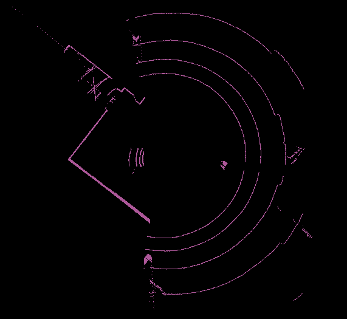
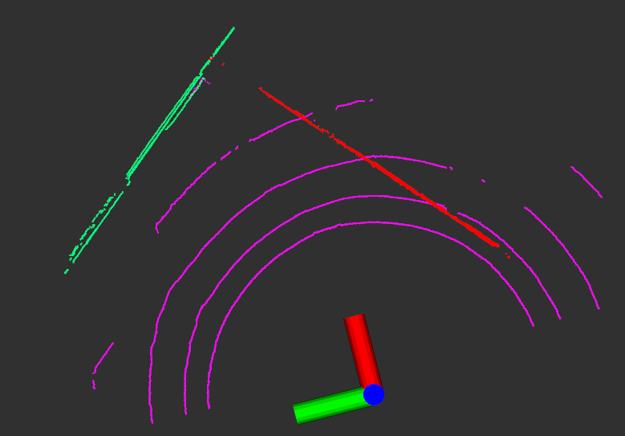
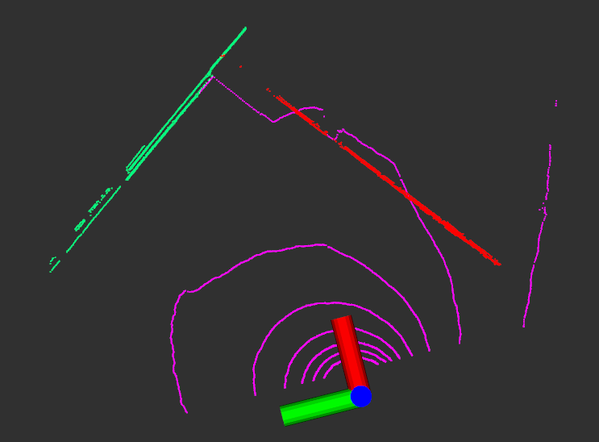
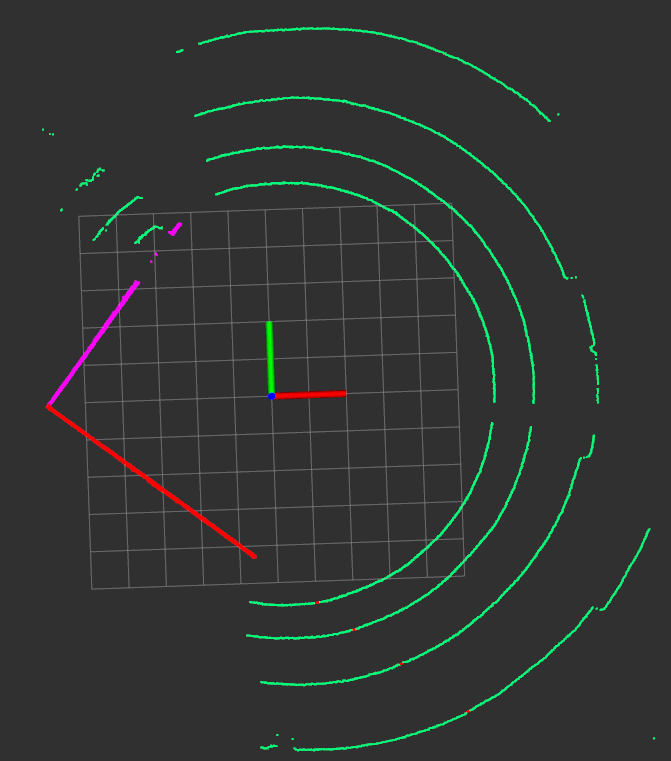
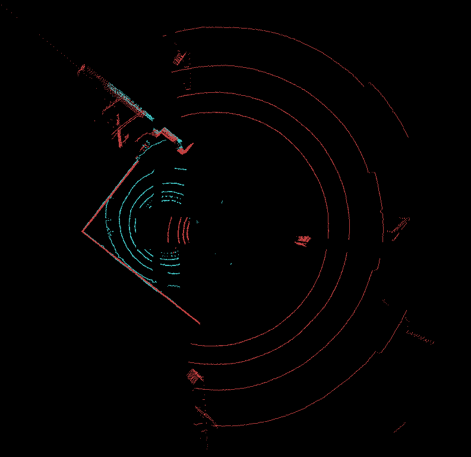
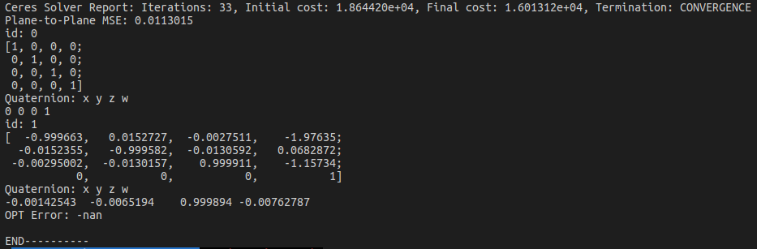

## Overview
This a ros package for multi lidar calibration improved qh's previous appearance-based work. Several method are to be implemented:

## Dependency List  
- PCL 1.8 ([http://pointclouds.org/](http://pointclouds.org/))
- Eigen 3
- Boost
- libpointmatcher ([https://github.com/ethz-asl/libpointmatcher](https://github.com/ethz-asl/libpointmatcher))
- Ceres-solver ([http://ceres-solver.org/](http://ceres-solver.org/))
- YAML ([https://github.com/jbeder/yaml-cpp](https://github.com/jbeder/yaml-cpp))

Test on Ubuntu 16.04, ROS Kinetic

## Usage
1. Create a yaml file ```cfg.yaml``` into a fold, please follow  <b>../data/example/top_tail/cfg.yaml</b> to write
2. Preproces raw pointcloud to keep points with only planes. You can use the below function or <b>CloudCompare</b> software like this:<br>
	```rosrun lidar_appearance_calibration calib_preprocess ../data/example/raw/ref.pcd ../data/example/raw/data.pcd ../data/example/raw/ref_filter.pcd ../data/example/raw/data_filter.pcd``` <br>
	
3. Extract planes from pointcloud <br>
	```rosrun lidar_appearance_calibration calib_plane_extraction pcd ../data/example/top_front/cfg.yaml``` <br>
	```rostopic pub /contact/icp std_msgs/String "data: ''"```
	```rviz -d ../rviz/plane_extraction```
4. Visualize and check the extracted plane order <br>
	```rosrun pcl_ros pcd_to_pointcloud ../data/example/top_front/plane/ref_planes.pcd 1```
	<br>
	
	<br>
	```rosrun pcl_ros pcd_to_pointcloud ../data/example/top_front/plane/data_planes.pcd 1```
	<br>
	
	<br>
	```rviz -d ../rviz/plane_extraction```
	<br>
5. Implement ICP to minimize Plane-to-Plane error <br>
   * Auto initialization <br>
		```rosrun lidar_appearance_calibration calib_icp ../data/example/top_front/ref_cfg.yaml ../data/example/top_front/data_cfg.yaml a```
	* Manual initialization <br>
	```rosrun lidar_appearance_calibration calib_icp ../data/example/top_front/ref_cfg.yaml ../data/example/top_front/data_cfg.yaml m```
	* Call the program <br>
	```rostopic pub /contact/save_plane std_msgs/String "data: ''"```
6. Visualize the calibration result <br>
	```pcl_viewer ../data/example/top_front/merged_opt.pcd```

## Result
1. Plane extraction <br>
	 <br>
2. Pointcloud fusion <br>
	 <br>
3. Calibration resut <br>
	 <br>

---
## LQH's previous work
1. [x]  ICP(point-plane minimizer, libpointmatcher)
2. [x]  plane fitting optimization(single shot)
3. [ ]  auxiliary objects(plane, stick)

## JJH's current work (20190103 - now)
1. [x] Automatic plane selection and correspondence matching <br>
    * [x] RANSAC <br>
	* [x] Order normal <br>
2. [x] Find rotation between three pairs of normals <br>
3. [x] Minimize point-to-plane error <br>
